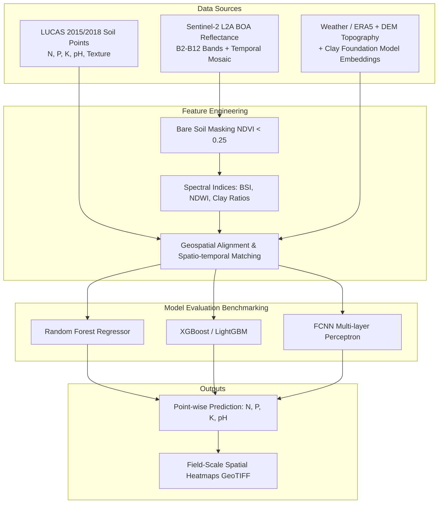
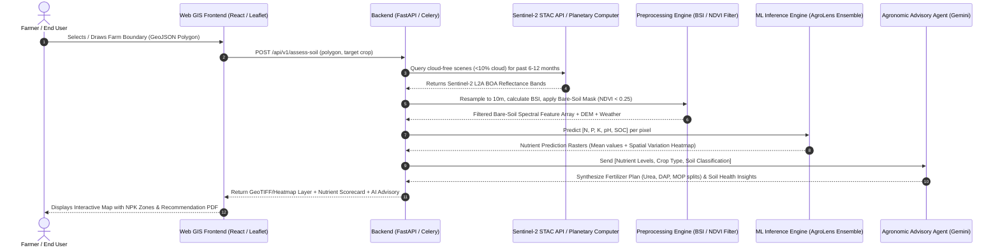
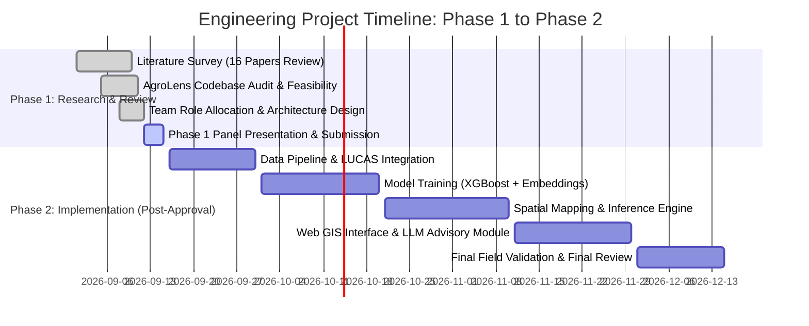

# Phase 1 Comprehensive Research & Feasibility Report
## AI-Driven Satellite Remote Sensing for Field-Scale Soil Nutrient (NPK) & Health Assessment

**Document Status:** Phase 1 Literature Survey, Feasibility Study & Project Proposal  
**Target Audience:** Academic Project Evaluation Panel, Faculty Mentors, and Project Team  
**Primary Reference Implementations:** [AgroLens (CVIMS / Kammerlander et al., 2025)](https://github.com/cvims/AgroLens)  
**Document Revision:** 1.0 (Phase 1 Baseline)

---

## Executive Summary

Soil testing is fundamental to sustainable agriculture and precision fertilizer application. However, traditional laboratory soil chemical testing (e.g., Kjeldahl nitrogen, Bray/Olsen phosphorus, flame photometry for potassium) is labor-intensive, time-consuming, expensive, and spatially sparse. 

This project investigates the technical and scientific feasibility of **predicting soil nutrient status—specifically Nitrogen (N), Phosphorus (P), Potassium (K), Soil Organic Carbon (SOC), and pH—using freely accessible Earth Observation (EO) satellite data** (primarily European Space Agency Copernicus **Sentinel-2 MSI**), machine learning/deep learning regression architectures, and auxiliary geospatial covariates.

Rather than leaping prematurely into coding, **Phase 1 focuses on establishing a rock-solid scientific foundation**:
1. Clarifying physical sensor capabilities vs. statistical correlations (what satellites can and cannot directly "see").
2. Identifying ground-truth calibration datasets (e.g., European LUCAS soil database, regional national soil registries).
3. Analyzing 16 high-impact research papers assigned across four engineering specialization roles.
4. Auditing state-of-the-art open-source pipelines, notably **AgroLens** (`cvims/AgroLens`), to identify architectural strengths and reproducibility gaps.
5. Formulating a verified methodology, validation framework, and defense strategy for the upcoming **Project Review Panel**.

---

## 1. Problem Statement & Motivation

### 1.1 The Agricultural Bottleneck
- **Cost & Accessibility:** Smallholder farmers and commercial growers alike face barriers in getting frequent soil tests. Laboratory turnaround times often range from 2 to 4 weeks, missing critical pre-sowing fertilization windows.
- **Spatial Resolution:** A standard composite soil test takes 10–15 core samples mixed into a single bag for an entire 5-acre or 10-acre plot, erasing intra-field spatial heterogeneity.
- **Over-Fertilization & Degradation:** Without site-specific nutrient insights, blanket chemical fertilizer application causes soil acidification, nitrogen leaching into groundwater, eutrophication, and ballooning input costs.

### 1.2 Proposed Phase 1 Objective
To construct a scientifically grounded research dossier and system architecture blueprint that evaluates:
- How **multispectral satellite bands** (VNIR, RedEdge, SWIR) correlate with soil physicochemical properties.
- How to filter out interference from **vegetation canopies, clouds, and surface moisture**.
- Which **machine learning regression models** (Tree-based ensembles vs. Neural Networks vs. Geospatial Foundation Model Embeddings) yield optimal generalizability ($R^2$, RMSE, RPIQ).
- How the final pipeline will ingest a user's boundary polygon (GeoJSON/KML) and output nutrient heatmaps and agronomic recommendations.

---

## 2. Scientific & Remote Sensing Fundamentals: What Can Satellites "See"?

> [!IMPORTANT]
> **Panel Defense Note (Crucial Scientific Honesty):**  
> An evaluation panel will immediately ask: *"Can an optical sensor 786 km in space directly detect elemental Potassium ions ($K^+$) or dissolved Nitrogen in the soil?"*  
> The answer is **NO, not directly via discrete atomic absorption bands**. Instead, optical remote sensing relies on **primary diagnostic spectral features (SOC, moisture, iron oxides, clay minerals)** and **secondary chromophore/physicochemical correlations**.

### 2.1 Spectral Absorption Mechanics in Soil
Soil reflectance across the electromagnetic spectrum (400 nm to 2500 nm) is governed by specific soil chromophores:

| Nutrient / Parameter | Sensing Mechanism | Key Diagnostic Wavelengths / Bands | Sentinel-2 MSI Equivalent Bands |
| :--- | :--- | :--- | :--- |
| **Nitrogen (N)** / **Organic Matter (SOM / SOC)** | **Strong Indirect / Proxy:** Nitrogen is bound within Soil Organic Matter (~5% of SOM is N). High SOC causes broad spectral darkening (lowered overall albedo) across Visible (VIS) and Shortwave Infrared (SWIR). | 660 nm, 1400 nm, 2100–2300 nm (C-H, O-H, N-H vibrational overtones) | Band 4 (Red: 665 nm), Band 8A (Narrow NIR: 865 nm), Band 11 (SWIR-1: 1610 nm), Band 12 (SWIR-2: 2190 nm) |
| **Phosphorus (P)** | **Secondary Covariance:** Available phosphorus does not exhibit narrow spectral absorption in VNIR/SWIR. It correlates statistically with clay minerals (Al-OH, Fe-OH lattice bonds) and iron oxides (Hematite, Goethite). | 450–550 nm (iron oxides), 2200 nm (clay mineral lattices) | Band 2 (Blue: 490 nm), Band 3 (Green: 560 nm), Band 11, Band 12 |
| **Potassium (K)** | **Secondary Covariance:** Exchangeable potassium ($K^+$) binds to clay surfaces (illite, vermiculite, smectite) and correlates with Cation Exchange Capacity (CEC). | 1400 nm, 1900 nm, 2200 nm (hydroxyl bonds in 2:1 clay minerals) | Band 11 (SWIR-1: 1610 nm), Band 12 (SWIR-2: 2190 nm) |
| **Soil Texture (Clay/Sand)** | **Direct Diagnostic:** Clay minerals produce sharp absorption dip at 2200 nm due to Al-OH bonds. Quartz/sand exhibits high uniform reflectance without distinct SWIR absorption dips. | 2200 nm, 2300 nm | Band 11 vs. Band 12 ratio |
| **Soil Moisture (SMC)** | **Strong Direct:** Water absorption bands at 1450 nm and 1940 nm depress reflectance across the entire SWIR region. | 1400–1900 nm | Normalized Difference Water Index (NDWI) via Band 8A & Band 11 |

### 2.2 The "Bare Soil" Challenge & Solutions
Satellite sensors view the surface from above. If a field is blanketed with dense green crops, the sensor reads the **chlorophyll reflectance curve** (high Green, low Red, extreme NIR "red edge" plateau), obscuring the topsoil.

**Three Methodological Countermeasures:**
1. **Multi-Temporal "Barest Soil" Compositing (Gholizadeh et al., 2021; Castaldi et al., 2019):**  
   Query satellite scenes across multiple seasons (specifically post-harvest / pre-emergence windows when farmers till and expose the land). Apply an NDVI threshold (e.g., $\text{NDVI} < 0.25$ or $0.30$) and Bare Soil Index (BSI) to identify exposed soil pixels.
2. **Sentinel-2 Multi-Spectral Instrument (MSI):**  
   Provides 13 spectral bands, 10m to 20m spatial resolution, and a 5-day revisit cycle, offering ample cloud-free temporal slices over agricultural tillage windows.
3. **Canopy-to-Soil Residual Modeling:**  
   During peak crop growth, canopy vigor (chlorophyll content tracked via RedEdge Bands 5, 6, 7) serves as a proxy for nitrogen uptake from the soil.

---

## 3. Deep Dive into Reference Implementation: AgroLens (`cvims/AgroLens`)

The open-source repository **AgroLens** (developed by CVIMS at Technische Hochschule Ingolstadt and MI4People, documented in Kammerlander et al., March 2025, arXiv:2503.22276) represents the most direct peer benchmark for this project.

### 3.1 AgroLens Architecture Breakdown
- **Repository Modules:**
  - `satellite_utils/`: Interfaces with Copernicus Sentinel Hub / Google Earth Engine (GEE) / Planetary Computer to download Sentinel-2 Level-2A (Bottom-of-Atmosphere surface reflectance) tiles corresponding to GPS coordinate pairs.
  - `nutrients_predictor/`: Contains scikit-learn, XGBoost, and PyTorch implementations of regression models predicting continuous target values: Total Nitrogen ($N$, g/kg), Available Phosphorus ($P$, mg/kg), Exchangeable Potassium ($K$, mg/kg), and pH.
  - `scripts/`: Data cleaning routines for joining tabular soil chemistry measurements with geospatial raster pixels.
- **Key Scientific Findings from Kammerlander et al. (2025):**
  - Incorporating **Clay AI foundation model embeddings** (spatiotemporal transformer pretrained on global multi-sensor satellite imagery) alongside raw spectral bands significantly improved out-of-distribution generalizability.
  - Tree-based models (**XGBoost and Random Forest**) routinely outperform standard deep neural networks (FCNN) when operating on tabular spectral bands due to tabular feature correlation structures and modest ground-truth sample sizes.
  - Performance varies significantly by nutrient:
    - **Soil Organic Carbon (SOC) and Nitrogen (N):** Highest accuracy ($R^2 \approx 0.65 - 0.78$) due to strong physical absorption in SWIR and direct connection to organic matter.
    - **Soil pH:** Moderate accuracy ($R^2 \approx 0.50 - 0.65$) correlated with carbonate and clay mineral presence.
    - **Phosphorus (P) and Potassium (K):** Challenging ($R^2 \approx 0.35 - 0.55$) because they depend on secondary mineral relationships; auxiliary environmental covariates (precipitation, parent rock, DEM slope/elevation) are critical to boosting predictive power.

---

## 4. Team Role Division & 16-Paper Research Matrix

To distribute engineering ownership effectively across the team's 4 members, the 16 core research papers are synthesized below with concrete member responsibilities:

### 4.1 Member 1: Data Engineering & Preprocessing Lead
**Domain:** Satellite Data Acquisition, Cloud Masking, Bare-Soil Filtering, Geospatial Alignment.

| Paper Reference | Core Insight & Methodological Contribution | Key Takeaway for Phase 1 |
| :--- | :--- | :--- |
| **Castaldi et al. (2019)** *(Copernicus Success Stories)* | Assessed Sentinel-2 MSI data for predicting SOC and texture across European agricultural croplands using bare-soil spectral composites. | Demonstrated that 10m/20m Sentinel-2 bands (especially Band 4, 8A, 11, 12) provide sufficient spectral resolution to replace airborne hyperspectral sensors for topsoil mapping if bare ground is isolated. |
| **Gholizadeh et al. (2021)** *(MDPI Remote Sensing)* | Multi-temporal Sentinel-2 and Landsat-8 time series used to extract topsoil attributes; compared single-date vs. multi-date median compositing. | Multi-temporal compositing (e.g., median reflectance across dry spring tillage periods) significantly dampens atmospheric noise and agricultural residue effects compared to single-date imagery. |
| **Piccoli et al. (2023)** *(MDPI Sensors)* | Evaluated Sentinel-3 multispectral imagery combined with Digital Elevation Model (DEM) derivatives using machine learning. | Topographic covariates (Elevation, Slope, Aspect, Topographic Wetness Index - TWI) strongly drive water runoff and nutrient accumulation in terrain depressions. |
| **Demattê et al. (2018)** *(Redalyc)* | Comprehensive development of Soil Spectral Libraries (SSL) and their use in classification and laboratory spectroscopy. | Establishes the baseline laboratory reflectance signatures (400–2500 nm) to calibrate and normalize broadband satellite band responses. |

**Member 1 Deliverables for Phase 1:**
- Specification of satellite data pipeline: Sentinel-2 L2A (BOA) download via Copernicus Data Space Ecosystem (CDSE) / Planetary Computer / GEE.
- Bare Soil Index (BSI) formula:
  $$\text{BSI} = \frac{(B_{11} + B_4) - (B_8 + B_2)}{(B_{11} + B_4) + (B_8 + B_2)}$$
- Spatial resampling workflow (bicubic / bilinear interpolation of 20m SWIR bands to match 10m VNIR bands).

---

### 4.2 Member 2: Machine Learning Model Lead
**Domain:** Model Architectures, Feature Selection, Spatial Cross-Validation, Regression Benchmarking.

| Paper Reference | Core Insight & Methodological Contribution | Key Takeaway for Phase 1 |
| :--- | :--- | :--- |
| **Kammerlander et al. (2025)** *(arXiv:2503.22276 - AgroLens)* | Unified evaluation of Random Forest, XGBoost, and FCNN on LUCAS data integrating Sentinel-2, ERA5 weather, and Clay AI embeddings for N, P, K, pH. | The benchmark baseline architecture for this project. Shows that combining spectral indices with foundation model embeddings yields the highest regression accuracy. |
| **Vohland et al. (2018)** *(MDPI Remote Sensing)* | Direct comparison of machine learning approaches (PLSR, Support Vector Machines, Random Forest) using Sentinel-2 and Landsat-8. | Non-linear ensemble methods (Random Forest / Gradient Boosters) consistently outperform classical linear chemometrics (Partial Least Squares Regression - PLSR) for multi-source remote sensing data. |
| **Frontiers in Remote Sensing (2024)** *(Systematic Review & Meta-analysis)* | Meta-analysis of soil texture prediction using remote sensing across 100+ published studies. | Documents typical performance bounds: Sand and Clay show highest predictability, while Silt has lower correlation; feature selection is critical to avoid overfitting. |
| **Dotto et al. (2018)** *(ScienceDirect)* | Predicting soil properties using machine learning, regional soil spectral libraries, and remote sensing environmental covariates. | Highlighting covariate importance: remote sensing spectral bands alone are rarely enough for P and K; climate (temperature, rainfall) and geology layers are vital. |

**Member 2 Deliverables for Phase 1:**
- Model selection matrix (XGBoost vs. LightGBM vs. CatBoost vs. Multi-Target Neural Networks).
- Spatial Cross-Validation Strategy: **Never use standard random k-fold cross-validation!** (Spatial autocorrelation causes severe data leakage where neighboring pixels leak into the test set, inflating $R^2$). Must specify **Spatial Block Cross-Validation** or **Spatial GroupKFold**.
- Evaluation metrics definition:
  - Coefficient of Determination ($R^2$)
  - Root Mean Squared Error ($\text{RMSE}$)
  - Ratio of Performance to Interquartile Distance ($\text{RPIQ} = \frac{IQR}{\text{RMSE}}$)

---

### 4.3 Member 3: Target Variables & Advisory/LLM Lead
**Domain:** Soil Chemistry Mechanics, Nutrient Conversion Standards, Target Definition, LLM Agronomic Advisory.

| Paper Reference | Core Insight & Methodological Contribution | Key Takeaway for Phase 1 |
| :--- | :--- | :--- |
| **Charishma et al. (2024)** *(Taylor & Francis)* | Estimation of topsoil physical and chemical properties using Sentinel-2 imaging and spectral index correlation. | Identifies optimal band-ratio combinations sensitive to nitrogen and organic fractions in top 0–20 cm soil depth. |
| **Ng et al. (2019)** *(ScienceDirect)* | Evaluating utility of Sentinel-2 spectral data for mapping topsoil organic carbon (SOC) in Australian conditions. | Confirms SOC can be mapped with high fidelity ($R^2 > 0.70$) when spectral noise from crop residue is properly filtered out. |
| **Bhargavi & Anitha (2026)** *(IJSET)* | Soil nutrient prediction model using data mining techniques for sustainable farming. | Explores decision tree rule extraction and soil fertility indexing for translating raw nutrient parts-per-million (ppm) into categorized fertility tiers (Low, Medium, High). |
| **CIGR Journal (2025)** *(CIGR Journal)* | Sensor-based framework for soil nutrients prediction using deep learning and hybrid feature extraction techniques. | Demonstrates hybrid feature fusion (fusing spectral reflectance with localized ground sensor data and environmental variables). |

**Member 3 Deliverables for Phase 1:**
- Definition of target chemical units:
  - Total Nitrogen ($N$ in g/kg or %)
  - Available Phosphorus (Olsen-P or Bray-P in mg/kg or ppm)
  - Available Potassium ($K_2O$ or exchangeable $K$ in mg/kg or ppm)
  - pH ($-\log[H^+]$) and Soil Organic Carbon (SOC %).
- Agronomic Recommendation Engine Blueprint:
  - Translating model outputs into actionable advice: Integrating an LLM agent (e.g., Gemini API) that takes predicted [N, P, K, pH], target crop (e.g., Wheat, Maize, Cotton, Rice), and regional guidance to formulate precise N-P-K fertilizer split schedules (Urea, DAP, MOP).

---

### 4.4 Member 4: System Integration & Spatial Mapping Lead
**Domain:** Digital Soil Mapping (DSM), Raster Processing Pipeline, End-to-End System Architecture, Web GIS Interface.

| Paper Reference | Core Insight & Methodological Contribution | Key Takeaway for Phase 1 |
| :--- | :--- | :--- |
| **Taghizadeh-Mehrjardi et al. (2020)** *(ScienceDirect)* | Digital mapping of soil organic carbon using remote sensing and machine learning in semi-arid environments. | Details spatial interpolation, uncertainty quantification (confidence interval mapping per pixel), and spatial continuous raster generation. |
| **IEEE Access (2021)** *(IEEE Xplore)* | Estimating Soil Organic Matter Content Using Sentinel-2 Imagery by Machine Learning. | Focuses on operational pixel-by-pixel inference pipeline converting raw Level-2A GeoTIFF tiles into calibrated SOM percentage maps. |
| **MDPI Sensors (2021)** *(MDPI)* | Machine Learning Strategy for Soil Nutrients Prediction Using Spectroscopic Data. | Examines high-dimensional feature preprocessing, dimensionality reduction (PCA), and inference latency optimization for real-time spatial evaluation. |
| **Wang et al. (2021)** *(MDPI)* | Soil salinity and nutrient mapping using machine learning algorithms with the Sentinel-2 MSI in agricultural zones. | Emphasizes spatial visualization: generating multi-layered GeoTIFF maps representing salinity index, nutrient gradients, and zone clustering. |

**Member 4 Deliverables for Phase 1:**
- System Architecture Diagram: User draws parcel polygon on map $\rightarrow$ backend queries Sentinel-2 API $\rightarrow$ preprocessor generates raster stack $\rightarrow$ ML regressor predicts 2D raster grid $\rightarrow$ GeoJSON / heatmap rendered on Leaflet/Mapbox frontend.
- Tech Stack Feasibility:
  - Geospatial backend: Python (FastAPI, rasterio, shapely, geopandas, xarray).
  - Data ingestion: Microsoft Planetary Computer STAC API / Copernicus Data Space Ecosystem API / Google Earth Engine Python API.
  - Frontend: React / Next.js with Mapbox GL JS / Leaflet, or Streamlit prototype.

---

## 5. Ground Truth Datasets for Model Training

A machine learning model cannot train without ground-truth labels. The panel will ask: *"Where do your training labels come from?"*

| Dataset Name | Geographical Coverage | Sample Count | Target Variables Available | Access & Licensing |
| :--- | :--- | :--- | :--- | :--- |
| **LUCAS Soil Database (2015/2018/2022)** *(European Commission - JRC)* | European Union (all member states) | ~22,000+ geo-referenced topsoil samples | Total Nitrogen (N), Available Phosphorus (P), Extractable Potassium (K), pH ($CaCl_2$ & $H_2O$), SOC, Clay/Silt/Sand, CEC | Free, Open Public Domain (Used by AgroLens and Castaldi et al.) |
| **SoilGrids250m** *(ISRIC - World Soil Information)* | Global (interpolated baseline) | 250m continuous global rasters | SOC, pH, bulk density, clay/sand/silt, CEC at multiple depth layers (0–5cm, 5–15cm) | Free Open Access (GeoTIFF / WCS API) |
| **National / Regional Soil Health Repositories** | Country-specific (e.g., India Soil Health Card Portal, USDA NRCS SSURGO) | Hundreds of thousands of localized records | N, P, K, Organic Carbon, Micronutrients (Zn, Fe, Cu, B), Electrical Conductivity (EC) | Government open data portals / Regional Agricultural Universities |

> [!TIP]
> **Recommended Strategy for Phase 1 Proposal:**
> Use the **LUCAS Soil Dataset** (as done in AgroLens) to train and benchmark the core model because it is laboratory-grade, standardized across thousands of points, and matches European Sentinel-2 overpasses perfectly. For local regional application (e.g., in India or local districts), propose a **Transfer Learning / Fine-Tuning approach**: pre-train on LUCAS + Earth Foundation Model, then fine-tune with local agricultural university soil test samples.

---

## 6. End-to-End System Architecture (Target for Phase 2 Implementation)

---

## 7. Panel Defense Guide: Anticipated Questions & Scientific Answers

When presenting this Phase 1 research to your academic review panel, be prepared for these critical questions:

### Q1: "Optical satellites only photograph the very top millimeter of the surface. How can you estimate root-zone nutrients?"
**Answer:**  
*"You are entirely correct, Professor. Multispectral sensors like Sentinel-2 MSI directly capture the surface reflectance of the top 0–5 cm (topsoil). However, topsoil nutrients are strongly linked to the root zone through agricultural tillage, rainfall infiltration, and biological cycling. Ground truth datasets like LUCAS explicitly sample the top 0–20 cm horizon. Our machine learning models learn the statistical transfer function between topsoil spectral signatures and the standardized top 20 cm agronomic root zone. Furthermore, during crop stages, canopy reflectance anomalies in the RedEdge bands serve as vertical bio-indicators of sub-surface nutrient uptake."*

### Q2: "What if the farmer's land currently has a standing green crop or heavy harvest residue?"
**Answer:**  
*"This is why single-date imagery is insufficient. In our data pipeline (Member 1), we implement a multi-temporal time-series query (as demonstrated by Gholizadeh et al., 2021 and Castaldi et al., 2019). We look back across the agricultural year to identify windows when the field was plowed or tilled (bare soil). We automatically filter pixels using a Normalized Difference Vegetation Index ($\text{NDVI} < 0.25$) and Bare Soil Index ($\text{BSI} > 0$). If no bare soil window exists in the past 12 months, the system flags a low-confidence warning and switches to canopy-chlorophyll proxy modeling rather than outputting false surface values."*

### Q3: "Phosphorus and Potassium do not have sharp spectral absorption lines in optical bands. Why do you claim you can predict them?"
**Answer:**  
*"Elemental P and K do not have isolated narrowband absorption features in multispectral imagery. Instead, our research relies on secondary covariance mechanisms documented by Dotto et al. (2018) and Kammerlander et al. (2025): Available P binds directly to iron/aluminum oxides and clay lattice structures, which have distinct absorption at 450–550 nm and 2200 nm (Sentinel-2 Bands 2, 3, 11, 12). Exchangeable K correlates with Cation Exchange Capacity (CEC) and illite-group clays. Furthermore, by incorporating auxiliary environmental covariates (digital elevation models from SRTM, ERA5 rainfall, and Clay AI embeddings), the model captures the pedological context governing nutrient distribution."*

### Q4: "Why not build a mobile app immediately instead of spending time on research?"
**Answer:**  
*"Because in remote sensing and AI in agriculture, 80% of project failures stem from garbage-in, garbage-out data: spatial data leakage, training on vegetated pixels mistaken for soil, or using models with high $R^2$ due to spatial autocorrelation that fail completely on a neighbor's farm. Phase 1 rigorously evaluates data availability, establishes spatial cross-validation protocols, replicates peer-reviewed benchmarks from AgroLens, and secures panel sign-off on the scientific methodology before committing to software engineering in Phase 2."*

---

## 8. Phase 1 Review Deliverables & Phase 2 Roadmap

### 8.1 Checklist for Panel Submission
- [x] Comprehensive Literature Review synthesized across all 4 team roles.
- [x] Scientific justification for optical remote sensing limitations and secondary covariance mechanics.
- [x] Benchmark audit of open-source state-of-the-art (**AgroLens**).
- [x] Specification of training datasets (LUCAS + Environmental Covariates).
- [x] Robust cross-validation strategy (Spatial Block Cross-Validation).
- [x] Clear system architecture for Phase 2 execution.
