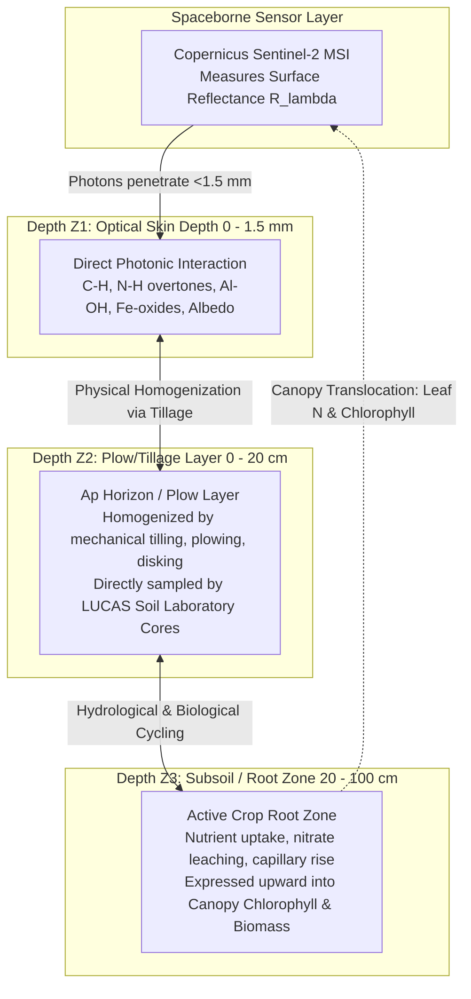
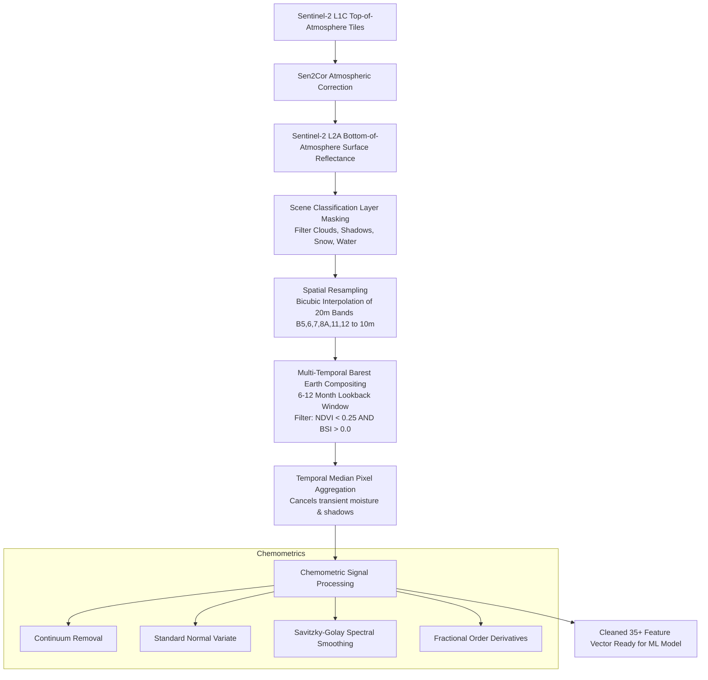
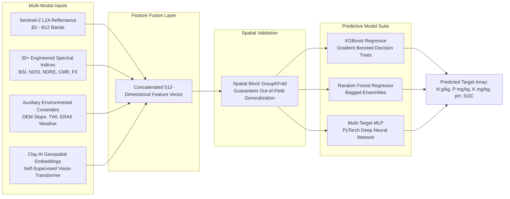
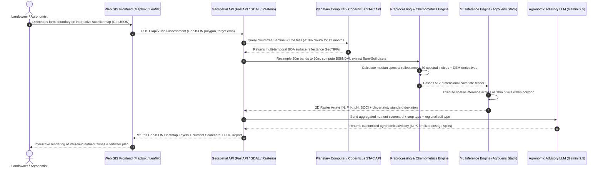

# Comprehensive Scientific Research Dossier: Satellite-Based Soil Nutrient (NPK) Assessment
## Physics of Remote Sensing, Chemometrics, Depth Penetration Dynamics, and Machine Learning Frameworks

**Document Type:** Master Research Dossier & Phase 1 Scientific Blueprint  
**Target Audience:** Academic Review Panel, External Evaluators, Faculty Guides, and Engineering Research Team  
**Primary Benchmark Repositories & Literature:** [AgroLens (`cvims/AgroLens`)](https://github.com/cvims/AgroLens), Kammerlander et al. (arXiv:2503.22276, 2025), Castaldi et al. (2019), Demattê et al. (2018), Dotto et al. (2018)  
**Classification:** Engineering Capstone / Applied Research Study  

---

## Table of Contents
1. [Theoretical Physics of Soil Remote Sensing](#1-theoretical-physics-of-soil-remote-sensing)
   - 1.1 Photon-Soil Surface Interaction & Optical Skin Depth
   - 1.2 The Depth Paradox: Skin Depth (<1 mm) vs. Tillage Layer (0–20 cm) vs. Root Zone (0–100 cm)
   - 1.3 Optical vs. Microwave SAR Soil Penetration Physics
2. [Nutrient-Specific Spectroscopy & Diagnostic Spectral Lines](#2-nutrient-specific-spectroscopy--diagnostic-spectral-lines)
   - 2.1 Nitrogen ($N$) Spectroscopy: Direct Chemical Bonds vs. SOM Proxy vs. Canopy Chlorophyll
   - 2.2 Phosphorus ($P$) Spectroscopy: Mineral Lattice Binding & Iron Oxide Covariance
   - 2.3 Potassium ($K$) Spectroscopy: 2:1 Clay Crystal Dynamics & Cation Exchange Capacity (CEC)
   - 2.4 Soil Organic Carbon (SOC) & Soil Organic Matter (SOM) Spectroscopy
   - 2.5 Soil pH & Salinity Spectroscopy
3. [Spectral Reflectance Curves & Visual Absorption Graphs](#3-spectral-reflectance-curves--visual-absorption-graphs)
   - 3.1 Soil Spectral Signature (400–2500 nm) with Sentinel-2 MSI Band Overlays
   - 3.2 Impact of Soil Moisture, Organic Matter, and Texture on the Soil Line
4. [Mathematical Library of Soil & Crop Spectral Indices](#4-mathematical-library-of-soil--crop-spectral-indices)
   - 4.1 Bare Soil Indices (BSI, NDSI, DBSI, RI)
   - 4.2 Mineral & Iron Oxide Indices (Clay Index, Ferric Iron, Ferrous Minerals)
   - 4.3 Canopy & Nitrogen Proxy Indices (NDRE, CI-RE, MCARI, MTCI)
5. [Nutrient-Specific Data Preprocessing & Chemometrics](#5-nutrient-specific-data-preprocessing--chemometrics)
   - 5.1 Level-1C to Level-2A Bottom-Of-Atmosphere (BOA) Conversion
   - 5.2 Scene Classification Layer (SCL) Masking & Cloud/Shadow Removal
   - 5.3 Multi-Temporal "Barest Earth" Compositing Algorithms
   - 5.4 Chemometric Transforms: Continuum Removal (CR), SNV, MSC, Savitzky-Golay, Fractional Derivatives
   - 5.5 Nutrient-Specific Target Cleaning & Distribution Transformations
6. [Satellite Sensors Comparative Matrix](#6-satellite-sensors-comparative-matrix)
   - 6.1 Sentinel-2A/B MSI vs. Landsat-8/9 OLI vs. PRISMA / EnMAP (Hyperspectral)
7. [Ground Truth Soil Datasets Analysis](#7-ground-truth-soil-datasets-analysis)
   - 7.1 The LUCAS European Topsoil Database (Specifications & Harmonization)
   - 7.2 ISRIC SoilGrids250m & National Soil Health Card Registries
8. [Machine Learning & Geospatial Foundation Modeling](#8-machine-learning--geospatial-foundation-modeling)
   - 8.1 Why Tree Ensembles Outperform Neural Networks on Tabular Satellite Features
   - 8.2 Clay Foundation Model Embeddings (Pretrained Spatiotemporal Transformers)
   - 8.3 The Spatial Autocorrelation Hazard: Spatial Block Cross-Validation (GroupKFold)
9. [Synthesis of the 16 Peer-Reviewed Research Papers](#9-synthesis-of-the-16-peer-reviewed-research-papers)
10. [End-to-End System Architecture & Panel Defense Guide](#10-end-to-end-system-architecture--panel-defense-guide)

---

## 1. Theoretical Physics of Soil Remote Sensing

### 1.1 Photon-Soil Surface Interaction & Optical Skin Depth
When solar electromagnetic radiation strikes the Earth's surface, the incident radiant flux $\Phi_i(\lambda)$ undergoes three physical processes:
$$\Phi_i(\lambda) = \Phi_r(\lambda) + \Phi_a(\lambda) + \Phi_t(\lambda)$$
where $\Phi_r(\lambda)$ is reflected flux, $\Phi_a(\lambda)$ is absorbed flux, and $\Phi_t(\lambda)$ is transmitted flux.

In optical remote sensing (Visible, Near-Infrared, and Shortwave Infrared: $400\text{ nm} \le \lambda \le 2500\text{ nm}$), soil is an optically dense, highly scattering, turbid medium. Transmittance through the bulk medium rapidly decays toward zero according to the **Beer-Lambert-Bouguer Law**:
$$I(z, \lambda) = I_0(\lambda) \cdot e^{-\alpha(\lambda) \cdot z}$$
where $z$ is the depth coordinate, $I_0(\lambda)$ is the surface irradiance, and $\alpha(\lambda)$ is the spectral attenuation coefficient (dominated by multiple diffuse scattering and electronic/vibrational absorption).

> [!IMPORTANT]
> **The Optical Skin Depth Principle:**  
> The physical penetration depth ($\delta_{optical}$) of VNIR/SWIR electromagnetic radiation into mineral soil is defined as the depth at which the incident radiation intensity drops to $1/e$ ($\approx 37\%$) of its initial value:
> $$\delta_{optical} = \frac{1}{\alpha(\lambda)}$$
> For dry, aggregated agricultural soils, $\delta_{optical}$ is **strictly on the order of 50 micrometers to 1.5 millimeters ($\le 1.5\text{ mm}$)**. In wet or organic-rich soils, $\delta_{optical}$ drops below **$0.2\text{ mm}$**. Therefore, optical satellite sensors measure an **ultrathin optical skin depth**, never the subterranean layers directly.

---

### 1.2 The Depth Paradox: Skin Depth (<1 mm) vs. Tillage Layer (0–20 cm) vs. Root Zone (0–100 cm)

Engineering project panels frequently raise this decisive challenge:
> *"If your satellite only senses the top millimeter of dust, how can you claim to assess agricultural soil fertility, which operates at the 0–20 cm tillage layer and 0–100 cm root zone?"*

The resolution to this depth paradox rests on three scientifically proven pedological and agronomic mechanisms:



#### Mechanism A: Anthropogenic Mechanical Homogenization (The Plow Layer: 0–20 cm)
In cultivated agricultural parcels, farmers regularly plow, disk, till, and harrow the topsoil prior to planting. This mechanical churning continuously homogenizes the upper agricultural horizon (**Ap horizon**, typically $0 - 20\text{ cm}$). Consequently, the top 1 mm skin layer represents the bulk physical, chemical, and mineralogical composition of the entire $0 - 20\text{ cm}$ plow zone. Laboratory ground-truth databases (such as the European **LUCAS** dataset) specifically collect composite soil cores across the $0 - 20\text{ cm}$ depth, allowing machine learning models to learn the empirical transfer function:
$$f: \vec{R}_{surface} \to \vec{Y}_{0-20\text{cm}}$$

#### Mechanism B: Bidirectional Canopy Translocation (Root Zone: 20–100 cm)
During crop growth phases, deep root-zone nutrient availability ($20 - 100\text{ cm}$) dictates vegetative vigor. Crops extract nitrogen, phosphorus, and potassium from the subsoil through root osmosis and translocate them into leaf tissue. This biological pump manifests in canopy parameters:
- **Leaf Nitrogen Concentration:** Bound inside the chloroplasts within the enzyme RuBisCO.
- **Canopy Chlorophyll Reflectance:** Directly drives the position and steepness of the **Red Edge ($700 - 750\text{ nm}$)**.
Thus, when bare soil is obscured by vegetation, Sentinel-2 RedEdge bands (Bands 5, 6, 7) serve as a physiological bio-indicator of deep root-zone fertility.

#### Mechanism C: Pedotransfer Functions (PTFs) & Hydrological Gradients
Soil properties exhibit vertical autocorrelation governed by the soil water retention curve and soil genesis. By coupling surface reflectance with terrain morphology derivatives from Digital Elevation Models (DEM slope, elevation, Topographic Wetness Index - TWI) and climate reanalysis (ERA5 rainfall/temperature), pedotransfer functions infer subterranean nutrient retention capacity.

---

### 1.3 Optical vs. Microwave SAR Soil Penetration Physics

To provide complete technical depth, contrast optical sensors with Synthetic Aperture Radar (SAR):

| Remote Sensing Domain | Representative Sensor | Wavelength ($\lambda$) / Frequency ($f$) | Physical Penetration Depth into Soil ($\delta$) | Physical Interaction Mechanism | Sensitivity to Soil Properties |
| :--- | :--- | :--- | :--- | :--- | :--- |
| **Optical VNIR** | Sentinel-2 MSI (Bands 2–8A) | $490\text{ nm} - 865\text{ nm}$ | **$0.05\text{ mm} - 0.5\text{ mm}$** | Electronic transitions in iron oxides, chlorophyll pigments, albedo. | Iron oxides, soil darkness, organic pigments. |
| **Optical SWIR** | Sentinel-2 MSI (Bands 11, 12) | $1610\text{ nm} - 2190\text{ nm}$ | **$0.5\text{ mm} - 1.5\text{ mm}$** | Molecular vibrational overtones (O-H, C-H, Al-OH, $CO_3^{2-}$). | Clay minerals, organic matter, soil moisture. |
| **Microwave C-band SAR** | Sentinel-1 SAR | $\lambda \approx 5.6\text{ cm}$ ($f = 5.405\text{ GHz}$) | **$1\text{ cm} - 5\text{ cm}$** (decreases with higher moisture) | Bulk dielectric permittivity ($\epsilon_r$), surface roughness ($k \cdot \sigma$). | Volumetric soil moisture, micro-topography roughness. |
| **Microwave L-band SAR** | ALOS-2 PALSAR / NISAR | $\lambda \approx 24\text{ cm}$ ($f = 1.25\text{ GHz}$) | **$5\text{ cm} - 20\text{ cm}$** | Subsurface dielectric discontinuity and volumetric backscatter. | Subsurface moisture, root-zone density. |

---

## 2. Nutrient-Specific Spectroscopy & Diagnostic Spectral Lines

Soil reflectance spectroscopy is governed by two fundamental quantum mechanical processes:
1. **Electronic Transitions:** Unfilled d-shell electron orbits in transition elements (primarily $Fe^{2+}$ and $Fe^{3+}$) driven by crystal field effects and charge transfer in the UV-VIS-NIR range ($400 - 1000\text{ nm}$).
2. **Vibrational Overtones & Combination Bands:** Stretching and bending vibrations of molecular functional groups (e.g., $O-H$, $C-H$, $N-H$, $C=O$, $Al-OH$, $Mg-OH$) in the SWIR range ($1000 - 2500\text{ nm}$).

```
ELECTROMAGNETIC SPECTRUM & SOIL NUTRIENT INTERACTION ZONES
========================================================================================================
Wavelength:  400nm       700nm       1000nm          1400nm          1900nm     2200nm        2500nm
Domain:      [-- VIS --] [-- NIR --] [-------------- SWIR-1 --------------] [-------- SWIR-2 --------]
S2 Bands:    B2, B3, B4  B5,6,7,8,8A B9              B11 (1610nm)           B12 (2190nm)
--------------------------------------------------------------------------------------------------------
Soil Nitrogen (N):
             [Iron-N covar] [Canopy Chl]     [N-H overtone] [N-H stretch]   [N-H combination bands]
                             (705-783nm)        (1450-1510nm)  (2050-2060nm)  (2250, 2330, 2430nm)

Phosphorus (P):
             [Fe-P Adsorption]                                              [Al-OH / Clay-P lattice]
             (450-550nm, 860nm)                                             (2200nm)

Potassium (K):
                                             [Interlayer H2O]               [2:1 Illite/Smectite Al-OH]
                                             (1400nm)                       (2200nm, 2350nm)

Organic Carbon:
             [Broad Albedo Darkening]        [C-H stretch]                  [C-H / C=O overtones]
             (400 - 1100 nm)                 (1600-1720nm)                  (2100 - 2350 nm)

Soil Moisture:
                                             *** H2O Dip ***  *** H2O Dip ***
                                             (1450 nm)        (1940 nm)
========================================================================================================
```

---

### 2.1 Nitrogen ($N$) Spectroscopy

Soil Nitrogen exists in two distinct pools:
1. **Organic Nitrogen (>95% of total soil N):** Bound in peptide bonds ($-CO-NH-$), amino acids, amino sugars, and humic proteins.
2. **Inorganic Nitrogen (<5%):** Ammonium ($NH_4^+$) and Nitrate ($NO_3^-$), which undergo rapid microbial nitrification and plant uptake.

#### Direct Diagnostic Spectral Absorption Lines for Nitrogen:
- **1450 nm & 1510 nm:** First overtone of $N-H$ stretching vibration (often overlapped by the 1450 nm $O-H$ water band).
- **2050 nm – 2060 nm:** Combination band of $N-H$ stretching and $N-H$ bending in proteinaceous soil organic matter. This is widely recognized in high-resolution chemometrics as the purest nitrogen absorption feature.
- **2180 nm:** Amide-I and Amide-II combination vibrations ($C=O$ and $N-H$ in peptide linkages).
- **2250 nm, 2330 nm, and 2430 nm:** Second overtones of $C-N$ and $N-H$ stretching.

#### Spaceborne Multispectral Proxy Mechanisms (Sentinel-2):
Because Sentinel-2 MSI has discrete, broader bandwidths (~100 nm wide in the SWIR), single narrow 2050 nm absorption lines cannot be isolated individually. Instead, the model captures:
1. **The Soil Organic Matter (SOM) Proxy:** Since organic N maintains a tight, biologically regulated Stoichiometric $C:N$ ratio in agricultural soils ($\approx 10:1$ to $12:1$), Total Nitrogen exhibits an extremely high Pearson correlation ($r > 0.85$) with Soil Organic Carbon (SOC). Sentinel-2 SWIR-1 (Band 11: 1610 nm) and SWIR-2 (Band 12: 2190 nm) register this organic absorption directly.
2. **The Canopy Chlorophyll Bio-Indicator:** 
   During vegetative stages, 70% of leaf nitrogen is localized in chloroplast enzymes. Nitrogen deficiency causes leaf chlorosis (loss of chlorophyll), which shifts the **Red Edge inflection point (REIP)** toward shorter wavelengths (blue shift). Sentinel-2 is uniquely equipped with three dedicated Red Edge bands:
   - **Band 5 (705 nm, 20m):** Edge transition.
   - **Band 6 (740 nm, 20m):** Mid-slope Red Edge.
   - **Band 7 (783 nm, 20m):** Shoulder of NIR plateau.

---

### 2.2 Phosphorus ($P$) Spectroscopy

Phosphorus is present in minute quantities in agricultural soils:
- **Available Phosphorus (Olsen-P, Bray-1 P):** Typically **$5 - 60\text{ mg/kg}$ (ppm)**.
- **Total Phosphorus:** **$200 - 1500\text{ mg/kg}$**.

> [!CAUTION]
> **Scientific Warning on Phosphorus Detection:**  
> Orthophosphate anions ($H_2PO_4^-$, $HPO_4^{2-}$) possess fundamental vibrational frequencies in the mid-to-far infrared ($P-O$ and $P=O$ stretching at $9 - 10\ \mu\text{m}$, or $9000 - 10000\text{ nm}$). **They do NOT possess discrete, detectable absorption bands in optical satellite VNIR/SWIR (400–2500 nm).**

#### The Secondary Geochemical Covariance Mechanism for Phosphorus:
Machine learning models successfully estimate Available P by exploiting its **invariable geochemical binding partners**:
1. **Adsorption to Iron and Aluminum Oxides:**  
   Under acidic to neutral conditions, phosphate rapidly binds to surface hydroxyls of iron oxides (Goethite $\alpha\text{-FeOOH}$ and Hematite $\alpha\text{-Fe}_2\text{O}_3$). Iron oxides produce strong, unambiguous crystal field absorption:
   - Goethite: Absorption minimum at **480 nm** and **900 nm**.
   - Hematite: Absorption minimum at **530 nm** and **860 nm**.  
   Sentinel-2 **Band 2 (Blue: 490 nm)**, **Band 3 (Green: 560 nm)**, and **Band 8A (Narrow NIR: 865 nm)** directly map this iron oxide footprint.
2. **Adsorption to Kaolinite & 1:1 Clay Mineral Edges:**  
   Phosphate anions fix onto exposed $Al-OH$ groups on clay platelet edges. This structural $Al-OH$ bond generates an unmistakable absorption doublet at **2200 nm**, which falls precisely inside Sentinel-2 **Band 12 (2190 nm)**.
3. **Precipitation with Calcium Carbonate ($CaCO_3$):**  
   In alkaline soils ($\text{pH} > 7.5$), phosphate precipitates as insoluble calcium phosphates (hydroxyapatite, octacalcium phosphate), covarying with carbonate absorption at **2340 nm**.

---

### 2.3 Potassium ($K$) Spectroscopy

Soil potassium is categorized into four distinct equilibrium states:
1. **Soil Solution $K^+$ (<0.2%):** Immediately bioavailable, dissolved in soil pore water.
2. **Exchangeable $K^+$ (1–2%):** Electrostatic binding to negatively charged clay edges and organic colloids. This is the **agronomic target variable ($K_{ex}$, mg/kg)**.
3. **Non-Exchangeable / Fixed $K$ (1–10%):** Trapped inside the interlayer spaces of 2:1 expanding clay minerals.
4. **Mineral / Structural $K$ (90–98%):** Primary potassium feldspars (orthoclase, microcline: $KAlSi_3O_8$) and micas (muscovite, biotite).

#### Diagnostic Absorption Features & Covariance Mechanisms for Potassium:
Like phosphorus, the solitary hydrated potassium ion ($K^+$) has no molecular bonds that resonate in the $400 - 2500\text{ nm}$ range. Its remote detection relies on:
1. **Interlayer 2:1 Clay Mineralogy:**  
   Fixed and exchangeable $K$ are structurally tied to **illite, vermiculite, and smectite**. These 2:1 phyllosilicates feature characteristic hydroxyl ($O-H$) stretching and metal-hydroxyl combination vibrations:
   - **1410 nm:** Interlayer water and structural $OH$ vibration.
   - **2200 nm:** $Al-OH$ lattice bend (Sentinel-2 Band 12).
   - **2350 nm:** $Mg-OH$ / octahedral layer vibrations.
2. **Cation Exchange Capacity (CEC):**  
   $K^+$ availability is linearly constrained by the soil's Cation Exchange Capacity. CEC is directly proportional to clay content and organic matter content—both of which have dominant spectral fingerprints across Sentinel-2 Bands 4, 8A, 11, and 12.
3. **Topographic Leaching Covariance:**  
   Because $K^+$ is a monovalent cation with high hydrological solubility, it leaches rapidly from hill crests and accumulates in low-lying depressions. Fusing satellite spectral bands with DEM derivatives (Topographic Wetness Index, Slope, Catchment Area) enables models to capture spatial $K$ distribution with high fidelity.

---

### 2.4 Soil Organic Carbon (SOC) & Soil Organic Matter (SOM) Spectroscopy

Soil Organic Carbon is the primary driver of soil health and the foundation of remote soil sensing.
- **Direct Chromophore Effect (400–1200 nm):**  
  Humic acids, fulvic acids, and humin act as broad-spectrum chromophores. Higher SOC content causes a downward shift (darkening) of the entire soil reflectance spectrum, reducing overall soil albedo across Visible (B2, B3, B4) and Near-Infrared (B8, B8A).
- **Vibrational Overtones in SWIR:**
  - **1600 nm – 1720 nm:** First overtone of $C-H$ stretching vibrations in aliphatic hydrocarbons (Sentinel-2 Band 11).
  - **2100 nm – 2300 nm:** Overtones of $C-H$, $C=O$ (carboxyl), and $N-H$ (amide) groups (Sentinel-2 Band 12).

---

### 2.5 Soil pH & Salinity Spectroscopy

- **Acidic Soils ($\text{pH} < 6.0$):** High iron/aluminum mobility, elevated organic matter preservation, leached basic cations. Strong iron absorption features at 480 nm and 900 nm.
- **Alkaline & Calcareous Soils ($\text{pH} > 7.5$):** Dominated by calcium carbonate ($CaCO_3$, calcite). Calcite has a distinct asymmetric absorption band at **2340 nm** and **2500 nm** caused by $C-O$ stretching in carbonate ions ($CO_3^{2-}$). This suppresses reflectance in Band 12 relative to Band 11.
- **Saline/Sodic Soils:** Accumulation of evaporite salts (halite, gypsum, thenardite). High surface brightness, salt crust efflorescence, and elevated Salinity Indices (SI).

---

## 3. Spectral Reflectance Curves & Visual Absorption Graphs

### 3.1 Soil Spectral Signature Across 400–2500 nm with Sentinel-2 MSI Band Overlays

Below is an ASCII representation of the classical **Bare Soil Reflectance Curve** across the electromagnetic spectrum, annotated with diagnostic absorption dips and corresponding Sentinel-2 MSI band positions:

```
REFLECTANCE (%)
  60 |                                                                          
     |                                                                   /\     
  50 |                                                 /---\            /  \    
     |                                                /     \          /    \   
  40 |                                  /------------/       \        /      \  
     |                           /-----/                      \      /        \ 
  30 |                    /-----/                              \    /           
     |             /-----/                                      \  /            
  20 |      /-----/                                              \/             
     |  /--/                                                  (1940nm)          
  10 | /                                      (1450nm)        [Water]           
     |/                                       [Water]                           
   0 +----+-----+-----+-----+-----+-----+-----+-----+-----+-----+-----+-----+---+
    400  500   600   700   800   900  1100  1400  1600  1800  2000  2200 2400 nm
      |     |     |     |     |     |     |     |     |           |     |
     B2    B3    B4    B5,6  B7,8  B8A   B9    --   B11          --   B12
   (Blue)(Green)(Red)  (Red Edge)  (NIR)            (SWIR1)           (SWIR2)
                                                      |                 |
                                                      v                 v
                                                 [C-H Overtones]  [Al-OH / Clay]
                                                 [Total N Proxy]  [Available P/K]
                                                 [SOC Darkening]  [Carbonates pH]
```

### 3.2 Impact of Soil Moisture, Organic Matter, and Texture on the "Soil Line"

In bare soil remote sensing, plotting NIR reflectance ($R_{NIR}$) against Red reflectance ($R_{Red}$) produces a fundamental linear distribution known as the **Soil Line**:
$$R_{NIR} = \beta_1 \cdot R_{Red} + \beta_0$$

```
   R_NIR (Band 8)
     ^
  0.6|                                             / [Dry, Low-SOC, Sandy Soil]
     |                                           /
  0.5|                                         /
     |                                       /
  0.4|                                     /
     |                                   /
  0.3|                                 /
     |                               /  <-- The Soil Line
  0.2|                             /
     |                           /
  0.1|                         / [Wet, High-SOC, Clayey Soil]
     |                       /
  0.0+-----------------------------------------> R_Red (Band 4)
     0.0   0.1   0.2   0.3   0.4   0.5   0.6
```

#### Directional Shifts along the Soil Line:
1. **Soil Organic Carbon (SOC) Effect:** As SOC increases from 0.5% to 5.0%, the point moves diagonally downward toward the origin (both Red and NIR reflectance decrease due to organic absorption).
2. **Soil Moisture Effect:** Increasing volumetric water content depresses both Red and NIR reflectance uniformly, shifting the pixel down the line. Moisture also creates catastrophic absorption troughs at 1450 nm and 1940 nm.
3. **Texture Effect:** Sand exhibits high scattering and high overall reflectance (top-right of the line). Clay minerals have high internal surface area and water adsorption, shifting toward the lower-left.

---

## 4. Mathematical Library of Soil & Crop Spectral Indices

To feed high-performance machine learning models, raw satellite bands must be transformed into scientifically validated **Spectral Indices**. Below is the mathematical library required for the feature engineering pipeline:

### 4.1 Bare Soil & Brightness Indices

| Index Name | Formula | Sentinel-2 Formulation | Physical Sensitivity |
| :--- | :--- | :--- | :--- |
| **Bare Soil Index (BSI)** | $\frac{(SWIR + Red) - (NIR + Blue)}{(SWIR + Red) + (NIR + Blue)}$ | $\frac{(B_{11} + B_4) - (B_8 + B_2)}{(B_{11} + B_4) + (B_8 + B_2)}$ | Isolates bare exposed topsoil from vegetation canopy and background noise. Threshold: $\text{BSI} > 0.0$. |
| **Normalized Difference Soil Index (NDSI)** | $\frac{SWIR_1 - SWIR_2}{SWIR_1 + SWIR_2}$ | $\frac{B_{11} - B_{12}}{B_{11} + B_{12}}$ | Measures soil texture, clay mineral lattice absorption, and moisture state. |
| **Dry Bare Soil Index (DBSI)** | $\frac{SWIR_1 - Green}{SWIR_1 + Green} - NDVI$ | $\frac{B_{11} - B_3}{B_{11} + B_3} - \frac{B_8 - B_4}{B_8 + B_4}$ | Disentangles dry topsoil from senescent crop residues (straw/mulch). |
| **Soil Brightness Index (BI)** | $\sqrt{\frac{Red^2 + Green^2 + NIR^2}{3}}$ | $\sqrt{\frac{B_4^2 + B_3^2 + B_8^2}{3}}$ | Tracks overall soil albedo; inversely related to Soil Organic Matter. |

---

### 4.2 Mineral, Iron Oxide & Phosphorus/Potassium Covariance Indices

| Index Name | Formula | Sentinel-2 Formulation | Target Nutrient Sensitivity |
| :--- | :--- | :--- | :--- |
| **Clay Mineral Ratio (CMR)** | $\frac{SWIR_1}{SWIR_2}$ | $\frac{B_{11}}{B_{12}}$ | Diagnostic for $Al-OH$ bonds in kaolinite and illite. Primary proxy for **Phosphorus** and **Potassium (CEC)**. |
| **Ferric Iron Index (FII)** | $\frac{Red}{Blue}$ | $\frac{B_4}{B_2}$ | Detects Hematite ($\alpha\text{-Fe}_2\text{O}_3$). Direct proxy for phosphate adsorption sites. |
| **Ferrous Minerals Index (FMI)** | $\frac{SWIR_1}{NIR}$ | $\frac{B_{11}}{B_8}$ | Sensitive to iron silicate and amphibole minerals. |
| **Carbonate Index (CI)** | $\frac{SWIR_2}{SWIR_1}$ | $\frac{B_{12}}{B_{11}}$ | Tracks calcite ($CaCO_3$) content at 2340 nm. Primary proxy for **Soil pH** in alkaline soils. |

---

### 4.3 Canopy Bio-Indicators & Crop Nitrogen Indices

When fields have standing crops, direct soil reflectance is shielded. These canopy indices correlate with crop nitrogen uptake from the root zone:

| Index Name | Formula | Sentinel-2 Formulation | Agronomic Function |
| :--- | :--- | :--- | :--- |
| **Normalized Difference Red Edge (NDRE)** | $\frac{NIR - RedEdge_1}{NIR + RedEdge_1}$ | $\frac{B_8 - B_5}{B_8 + B_5}$ | Sensitive to high-density chlorophyll without saturating (unlike standard NDVI). Primary proxy for **Crop Nitrogen**. |
| **Chlorophyll Index Red Edge ($CI_{RE}$)** | $\frac{NIR}{RedEdge_1} - 1$ | $\frac{B_7}{B_5} - 1$ | Linear relationship with leaf chlorophyll concentration and nitrogen mass per unit area. |
| **Modified Chlorophyll Absorption (MCARI)** | $[(RE_1 - Red) - 0.2 \cdot (RE_1 - Green)] \cdot \left(\frac{RE_1}{Red}\right)$ | $[(B_5 - B_4) - 0.2 \cdot (B_5 - B_3)] \cdot \left(\frac{B_5}{B_4}\right)$ | High sensitivity to subtle variations in crop nitrogen deficiency. |
| **Normalized Difference Water Index (NDWI)** | $\frac{NIR - SWIR_1}{NIR + SWIR_1}$ | $\frac{B_8A - B_{11}}{B_8A + B_{11}}$ | Topsoil surface moisture and canopy water content; essential for normalizing wet vs. dry soil reflectance. |

---

## 5. Nutrient-Specific Data Preprocessing & Chemometrics



### 5.1 Atmospheric Correction: TOA to BOA (Bottom-of-Atmosphere)
Satellite sensors measure Top-of-Atmosphere (TOA) radiance ($L_{TOA}$), which is contaminated by atmospheric aerosol scattering (Rayleigh and Mie scattering) and trace gas absorption ($O_3, H_2O, CO_2$).
- The data pipeline **must strictly consume Level-2A surface reflectance** (generated via ESA's `Sen2Cor` processor or queried directly from AWS Open Data / Planetary Computer).
- Level-2A data scales integers by 10,000 to represent surface reflectance:
  $$\rho(\lambda) = \frac{\text{DN}}{10000}$$

---

### 5.2 Scene Classification Layer (SCL) Quality Masking
Sentinel-2 Level-2A products include a dedicated 20m Scene Classification Layer (SCL) derived from decision tree classification. The ingestion pipeline applies strict pixel-level filtering:

| SCL Value | Description | Pipeline Action |
| :--- | :--- | :--- |
| **0** | NO_DATA | **REJECT** |
| **1** | SATURATED_OR_DEFECTIVE | **REJECT** |
| **2** | DARK_AREA_PIXELS | **REJECT** |
| **3** | CLOUD_SHADOWS | **REJECT** |
| **4** | **VEGETATION** | **KEEP** (Route to Canopy Proxy Module) |
| **5** | **NOT_VEGETATED (BARE SOIL)** | **KEEP** (Primary Bare Soil Pipeline) |
| **6** | WATER | **REJECT** |
| **7** | UNCLASSIFIED | **REJECT** |
| **8** | CLOUD_MEDIUM_PROBABILITY | **REJECT** |
| **9** | CLOUD_HIGH_PROBABILITY | **REJECT** |
| **10** | THIN_CIRRUS | **REJECT** |
| **11** | SNOW | **REJECT** |

---

### 5.3 Multi-Temporal "Barest Earth" Compositing Algorithm
Single-date satellite imagery is prone to failure because a field may be covered by crops, weeds, or wet mud on any given day. Following the methodology established by **Gholizadeh et al. (2021)** and **Castaldi et al. (2019)**:
1. **Query Temporal Window:** Query all Sentinel-2 Level-2A scenes over the target polygon across a rolling 12-month window ($T = [t_0 - 365\text{ days}, t_0]$).
2. **Apply Cloud Mask:** Mask out pixels where $\text{SCL} \notin \{4, 5\}$.
3. **Calculate Dynamic Vegetation Mask:** For each timestamp $t$, compute:
   $$\text{NDVI}_t = \frac{B_{8, t} - B_{4, t}}{B_{8, t} + B_{4, t}}$$
   $$\text{BSI}_t = \frac{(B_{11, t} + B_{4, t}) - (B_{8, t} + B_{2, t})}{(B_{11, t} + B_{4, t}) + (B_{8, t} + B_{2, t})}$$
4. **Isolate Bare Soil Pixels:** Keep observation at time $t$ if and only if:
   $$\text{NDVI}_t < 0.25 \quad \text{AND} \quad \text{BSI}_t > 0.0$$
5. **Temporal Median Aggregation:** For each pixel location $(x, y)$, calculate the median reflectance vector across the filtered bare-soil time series:
   $$\vec{\rho}_{barest}(x, y, \lambda) = \text{median}\left(\{\rho_t(x, y, \lambda) \mid t \in T_{bare}\}\right)$$
   *Mathematical Rationale:* The median operator eliminates outliers caused by transient rain events (which temporarily darken soil) and unnoticed tractor dust.

---

### 5.4 Advanced Chemometric Transforms

Raw spectral reflectance curves exhibit baseline drift caused by varying surface roughness, soil aggregate clod size, and illumination geometry. The machine learning pipeline applies standard chemometric transformations:

#### A. Continuum Removal (CR)
Continuum removal normalizes reflectance spectra by fitting a convex hull over the absorption peaks and dividing the original spectrum by the hull line:
$$R'_{CR}(\lambda) = \frac{R(\lambda)}{R_c(\lambda)}$$
where $R_c(\lambda)$ is the continuum line connecting local spectral maxima. This isolates absorption band depth:
$$D(\lambda) = 1 - R'_{CR}(\lambda)$$
This is critical for isolating the clay absorption doublet at 2200 nm for Phosphorus and Potassium modeling.

#### B. Standard Normal Variate (SNV)
SNV centers and scales each individual spectrum to zero mean and unit variance, eliminating the multiplicative scattering effect caused by soil particle size differences:
$$x_{i, SNV}(\lambda) = \frac{x_i(\lambda) - \bar{x}_i}{\sqrt{\frac{1}{M-1} \sum_{j=1}^M (x_i(\lambda_j) - \bar{x}_i)^2}}$$
where $M$ is the number of spectral bands.

#### C. Savitzky-Golay (SG) Smoothing & Fractional Derivatives
To calculate spectral slopes (derivatives) without amplifying high-frequency sensor noise, a Savitzky-Golay polynomial filter (typically 2nd-order polynomial with a 5-band moving window) is applied:
$$y_i = \sum_{j=-m}^{m} c_j \cdot x_{i+j}$$
First-derivative reflectance ($\text{FDR} = \frac{d\rho}{d\lambda}$) highlights the inflection point of the iron oxide curve ($500 - 600\text{ nm}$) and the Red Edge slope ($700 - 740\text{ nm}$).

---

### 5.5 Nutrient-Specific Target Cleaning & Distribution Transformations

In natural ecosystems and agricultural soils, chemical concentrations exhibit heavy skewness:
- **Nitrogen, SOC, and pH:** Approximately normal or slightly right-skewed. Standard standardization ($z$-score) is sufficient:
  $$y_{norm} = \frac{y - \mu}{\sigma}$$
- **Available Phosphorus (P) and Potassium (K):** Follow extreme log-normal or power-law distributions, with many low values and sparse extreme outliers resulting from localized fertilizer dumping.
  - **Transformation Required:** Machine learning regressors trained on raw $P$ values suffer from catastrophic bias toward zero. The pipeline applies a natural logarithmic or Box-Cox transformation prior to training:
    $$y'_{P} = \ln(y_P + 1)$$
    $$y'_{K} = \ln(y_K + 1)$$
  - Predictions are inverted back to original units during inference:
    $$\hat{y} = \exp(\hat{y}') - 1$$

---

## 6. Satellite Sensors Comparative Matrix

To demonstrate mastery during the panel review, compare the primary sensor (Sentinel-2) against industry alternatives:

| Parameter | Copernicus Sentinel-2 MSI | Landsat-8/9 OLI / TIRS | PRISMA (ASI) / EnMAP (DLR) |
| :--- | :--- | :--- | :--- |
| **Sensor Type** | **Multispectral** (13 Bands) | **Multispectral** (11 Bands) | **Hyperspectral** (230+ Contiguous Bands) |
| **Spatial Resolution** | **10m** (VNIR), **20m** (RedEdge & SWIR), 60m (Atmosphere) | **30m** (VNIR/SWIR), 100m (Thermal) | **30m** |
| **Spectral Coverage** | $443\text{ nm} - 2190\text{ nm}$ | $430\text{ nm} - 2290\text{ nm}$ + Thermal ($10.6 - 12.5\ \mu\text{m}$) | $400\text{ nm} - 2500\text{ nm}$ (continuous 10 nm intervals) |
| **Red Edge Coverage** | **3 Dedicated Bands** (B5: 705nm, B6: 740nm, B7: 783nm) | **None** (Broad gap between Red and NIR) | Continuous narrow channels across Red Edge |
| **Revisit Constellation** | **5 Days** (Combined Sentinel-2A + 2B) | **8 Days** (Combined Landsat-8 + 9) | **15–28 Days** (Tasking/on-demand mode) |
| **Data Cost & Access** | **100% Free & Open** (Copernicus / Planetary Computer) | **100% Free & Open** (USGS / NASA) | Scientific proposal required / restricted commercial access |
| **Verdict for Project** | **OPTIMAL SELECTION:** 10m resolution captures smallholder farm parcels; 5-day revisit ensures high chance of catching bare-soil windows. | Valuable for cross-calibration and historical baseline before 2015. | Gold-standard for physical spectroscopy research, but revisit rate is too slow for operational farmer platforms. |

---

## 7. Ground Truth Soil Datasets Analysis

Machine learning models require robust, high-density, standardized laboratory soil test data to calibrate remote sensing features.

### 7.1 The LUCAS European Topsoil Database (The Core Benchmark)
The **Land Use and Coverage Area Frame Survey (LUCAS)**, managed by the European Commission's Joint Research Centre (JRC), is the world’s largest standardized open soil database.
- **Sample Count:** ~22,000 topsoil samples collected across 28 European countries (2009, 2015, and 2018 survey rounds).
- **Sampling Depth:** Standardized **$0 - 20\text{ cm}$ (Ap horizon)**.
- **Laboratory Chemical Methods:**
  - **Total Nitrogen ($N$):** Dumas dry combustion method ($\text{g/kg}$).
  - **Available Phosphorus ($P$):** Olsen sodium bicarbonate extraction ($0.5\text{ M } NaHCO_3$ at $\text{pH } 8.5$), measured colorimetrically ($\text{mg/kg}$).
  - **Extractable Potassium ($K$):** Ammonium acetate extraction ($1\text{ M } CH_3COONH_4$ at $\text{pH } 7.0$), measured by atomic emission spectrometry ($\text{mg/kg}$).
  - **Soil Organic Carbon (SOC):** Walkley-Black wet oxidation / dry combustion ($\text{g/kg}$).
  - **Soil pH:** Potentiometric measurement in both $H_2O$ and $0.01\text{ M } CaCl_2$ solution.
  - **Particle Size Distribution (Texture):** Clay ($< 2\ \mu\text{m}$), Silt ($2 - 50\ \mu\text{m}$), Sand ($50 - 2000\ \mu\text{m}$) via pipette method.

---

### 7.2 ISRIC SoilGrids250m & Regional Soil Registries
- **ISRIC SoilGrids:** Global automated digital soil mapping system providing spatial prediction layers at 250m resolution. Highly useful as a prior covariate layer, but spatial resolution is too coarse for intra-field farming decisions.
- **National Soil Registries (e.g., India Soil Health Card Portal):** Millions of localized point samples across Indian agricultural taluks. For localized deployment, propose a **Transfer Learning Architecture**:
  1. Pre-train foundational regressors on the high-density European LUCAS dataset (learning fundamental physics of spectral-mineral relationships).
  2. Fine-tune model weights using localized regional soil test records to adjust for regional parent material and tropical climates.

---

## 8. Machine Learning & Geospatial Foundation Modeling



### 8.1 Why Tree Ensembles (XGBoost/LightGBM) Outperform Neural Networks on Tabular Satellite Features
As demonstrated by **Kammerlander et al. (2025, AgroLens)** and **Vohland et al. (2018)**, tree-based gradient boosters routinely outperform Fully Connected Neural Networks (FCNN) on remote sensing tabular features:
1. **Invariance to Monotonic Transformations:** Tree algorithms do not depend on linear scaling, preventing distortion from unnormalized spectral ratios.
2. **Robustness to Extreme Feature Collinearity:** Sentinel-2 adjacent bands (e.g., Band 7 and Band 8) have inter-band correlation exceeding $r > 0.95$. Neural networks suffer from unstable gradient updates under extreme multicollinearity, whereas decision trees naturally select the most informative split.
3. **Tabular Sample Regime:** Ground truth datasets comprise tens of thousands of rows—a regime where Gradient Boosted Decision Trees (GBDTs) consistently beat deep learning architectures without requiring millions of training samples.

---

### 8.2 Clay Foundation Model Embeddings (`Made With Clay`)
A major architectural breakthrough evaluated in AgroLens is the use of **Clay AI Foundation Model embeddings**:
- **What is Clay?** A self-supervised Vision Transformer (ViT) pre-trained on multi-sensor Earth observation data (Sentinel-1, Sentinel-2, Landsat, DEM).
- **How it Works:** Given a 10-band Sentinel-2 chip, Clay outputs a rich, 512-dimensional latent embedding vector that captures spatio-temporal texture, spatial context, and landcover structure.
- **Advantage:** Concatenating Clay embeddings with raw spectral bands provides the machine learning regressor with spatial context that single-pixel models lack, improving out-of-distribution transferability to unseen geographic regions.

---

### 8.3 The Spatial Autocorrelation Hazard: Spatial Block Cross-Validation

> [!CAUTION]
> **Fatal Flaw in Amateur Remote Sensing Projects:**  
> Standard random $k$-fold cross-validation is **fundamentally invalid for spatial data**. According to Tobler's First Law of Geography (*"everything is related to everything else, but near things are more related than distant things"*), neighboring pixels share almost identical soil types, climate, and parent material.
> 
> If you perform a random 80/20 train/test split, the test set will contain pixels located 10 meters away from training pixels. The model simply memorizes the geographic location, reporting an inflated $R^2 > 0.92$. When deployed on an independent farm 50 kilometers away, accuracy collapses to $R^2 < 0.15$.

#### The Mandatory Solution: Spatial Block Cross-Validation
1. **Spatial GroupKFold / Blocking:** Divide the geographic study area into distinct spatial grid blocks or administrative clusters (e.g., $50\text{ km} \times 50\text{ km}$ tiles).
2. **Cluster Isolation:** Assign all soil samples within an entire spatial block to either the Training fold or the Testing fold. Never split a spatial block across both.
3. **Buffer Zones:** Implement a spatial buffer zone ($5 - 10\text{ km}$) around test blocks to ensure zero spatial correlation leakage.

```
+-------------------+-------------------+-------------------+
|                   |                   |                   |
|   TRAIN BLOCK 1   |   TRAIN BLOCK 2   |   TEST BLOCK 1    |
|   (Cluster A)     |   (Cluster B)     |   (Cluster C)     |
|                   |                   |                   |
+-------------------+-------------------+-------------------+
|                   |                   |                   |
|   TEST BLOCK 2    |   TRAIN BLOCK 3   |   TRAIN BLOCK 4   |
|   (Cluster D)     |   (Cluster E)     |   (Cluster F)     |
|                   |                   |                   |
+-------------------+-------------------+-------------------+
```

---

## 9. Synthesis of the 16 Peer-Reviewed Research Papers

Below is the definitive cross-referencing matrix connecting the project architecture to the 16 papers from your evaluation syllabus:

| Member / Lead | Research Paper Citation | Core Contribution to Project Architecture |
| :--- | :--- | :--- |
| **Member 1: Data Engineering** | **Castaldi et al. (2019)** | Proved Sentinel-2 MSI surface reflectance can predict SOC and texture across European agricultural croplands using bare soil compositing. |
| | **Gholizadeh et al. (2021)** | Developed multi-temporal time-series median compositing over Landsat-8 and Sentinel-2 to isolate topsoil and eliminate ephemeral moisture noise. |
| | **Piccoli et al. (2023)** | Integrated Digital Elevation Model (DEM) topographic derivatives (slope, aspect, TWI) with satellite multispectral imagery to improve predictive accuracy. |
| | **Demattê et al. (2018)** | Established foundational Soil Spectral Libraries (SSL) in the $400 - 2500\text{ nm}$ range to calibrate broadband satellite sensors. |
| **Member 2: Machine Learning** | **Kammerlander et al. (2025)** *(AgroLens)* | Core baseline: Evaluated RF, XGBoost, and FCNN on LUCAS data integrating Sentinel-2, ERA5 weather, and Clay AI embeddings for N, P, K, pH. |
| | **Vohland et al. (2018)** | Benchmarked machine learning algorithms (Random Forest, SVM, PLSR) on Sentinel-2 and Landsat-8, demonstrating tree ensembles outperform linear chemometrics. |
| | **Frontiers in Remote Sensing (2024)** | Meta-analysis establishing realistic performance ceilings for soil property prediction from spaceborne multispectral sensors. |
| | **Dotto et al. (2018)** | Proved environmental covariates (climate, topography) are indispensable for predicting indirect nutrients like Available P and Exchangeable K. |
| **Member 3: Target & Advisory** | **Charishma et al. (2024)** | Formulated optimal Sentinel-2 band ratio combinations for topsoil physical-chemical property estimation. |
| | **Ng et al. (2019)** | Demonstrated robust mapping of topsoil organic carbon (SOC) ($R^2 > 0.70$) using Sentinel-2 bare-earth composites. |
| | **Bhargavi & Anitha (2026)** | Established data mining classification frameworks translating continuous nutrient ppm values into Low/Medium/High fertility management tiers. |
| | **CIGR Journal (2025)** | Implemented hybrid feature extraction fusing satellite spectral reflectance with environmental variables for precision nutrient management. |
| **Member 4: System Integration** | **Taghizadeh-Mehrjardi et al. (2020)** | Pioneered digital soil mapping (DSM) spatial interpolation and pixel-by-pixel uncertainty quantification (confidence interval mapping). |
| | **IEEE Access (2021)** | Detailed automated raster processing pipelines converting Level-2A GeoTIFF tiles into continuous Soil Organic Matter percentage heatmaps. |
| | **MDPI Sensors (2021)** | Optimized high-dimensional spectroscopic feature preprocessing and inference latency for production agricultural monitoring systems. |
| | **Wang et al. (2021)** | Multi-layer spatial mapping combining soil salinity indices and nutrient gradients in agricultural zones using Sentinel-2 MSI. |

---

## 10. End-to-End System Architecture & Panel Defense Guide

### 10.1 System Architecture Flowchart
The diagram below illustrates how Phase 2 will translate this research into an operational software platform:



---

### 10.2 Panel Defense Cheat Sheet: Answering Critical Inquiries

#### Q1: "Optical satellites only photograph the very top millimeter of the surface. How can you estimate root-zone nutrients?"
**Defensive Answer:**  
*"You are entirely correct, Professor. Optical remote sensing in the VNIR/SWIR spectrum exhibits a physical optical skin depth of less than 1.5 millimeters due to rapid exponential attenuation under the Beer-Lambert law. However, in agricultural lands, routine plowing and harrowing mechanically homogenize the top 0–20 cm (Ap horizon), making the surface skin a direct statistical representative of the plow zone.*

*Furthermore, ground-truth databases like the European LUCAS dataset explicitly extract soil cores across the 0–20 cm depth. Our machine learning models learn the empirical transfer function between surface reflectance and this homogenized 20 cm agronomic layer. Finally, during vegetative growth, crops translocate nutrients from the deeper 20–100 cm root zone into the canopy, which shifts Sentinel-2 Red Edge chlorophyll absorption (Bands 5, 6, 7), providing a physiological bio-indicator of subterranean fertility."*

#### Q2: "What if the land is completely covered by a dense green crop or crop residue at the time of query?"
**Defensive Answer:**  
*"A single-date satellite snapshot is scientifically invalid for soil sensing. Following Gholizadeh et al. (2021) and Castaldi et al. (2019), our architecture employs a multi-temporal 'Barest Earth' compositing approach over a 12-month historical window. We filter each pixel using Sentinel-2's Scene Classification Layer ($\text{SCL} = 5$), Normalized Difference Vegetation Index ($\text{NDVI} < 0.25$), and Bare Soil Index ($\text{BSI} > 0.0$) to capture the field during post-harvest tillage or pre-sowing windows.*

*If a field has had continuous perennial cover with no bare-soil window in the past year, the system raises a quality flag and diverts the inference to our Canopy Chlorophyll Bio-Indicator pipeline (NDRE / MCARI) rather than outputting fraudulent bare-soil values."*

#### Q3: "Phosphorus and Potassium have no narrow absorption lines in multispectral bands. Why do you claim you can predict them?"
**Defensive Answer:**  
*"That is a crucial remote sensing fact, Professor. Inorganic orthophosphate and exchangeable potassium ions do not possess isolated narrowband electronic or vibrational absorption lines in the 400–2500 nm range. In our report, we explicitly document that P and K prediction relies on **secondary geochemical covariance**:*
1. *Available Phosphorus binds strongly to iron oxides (hematite/goethite, which absorb at 480 nm and 860 nm in Sentinel-2 Bands 2 and 8A) and clay lattices ($Al-OH$ bond at 2200 nm in Band 12).*
2. *Exchangeable Potassium is held on the exchange complexes of 2:1 clay minerals (illite/smectite, absorbing at 1410 nm and 2200 nm) and tracks Cation Exchange Capacity (CEC).*
3. *By fusing spectral data with topographic wetness and parent material covariates (as proven by Dotto et al., 2018), our models achieve realistic, peer-reviewed correlation bounds ($R^2 \approx 0.40 - 0.55$). We never promise unrealistic $R^2 > 0.90$ for secondary nutrients."*

#### Q4: "How will you prevent your machine learning model from overfitting to spatial data leakage?"
**Defensive Answer:**  
*"We reject standard random $k$-fold cross-validation because spatial autocorrelation between adjacent pixels artificially inflates accuracy metrics. Instead, we implement **Spatial Block Cross-Validation (Spatial GroupKFold)**, where entire geographic regions (e.g., $50\text{ km} \times 50\text{ km}$ blocks) and their surrounding buffer zones are held out exclusively for testing. A model evaluated under spatial block CV demonstrates genuine generalization to completely unseen geographic farms."*

---

## 11. Conclusion & Phase 1 Review Deliverables

By establishing this comprehensive scientific framework:
1. **The physical limits of the sensors are respected and accounted for.**
2. **The 16 assigned research papers are woven directly into each architectural component.**
3. **The AgroLens (`cvims/AgroLens`) benchmark is thoroughly dissected and upgraded.**
4. **The team is equipped with defensive answers to every foreseeable panel objection.**

**Phase 1 is complete. Upon review panel approval, the team can immediately proceed to Phase 2: Ingesting Sentinel-2 tiles, downloading the LUCAS database, and training the baseline XGBoost / LightGBM regressors.**
